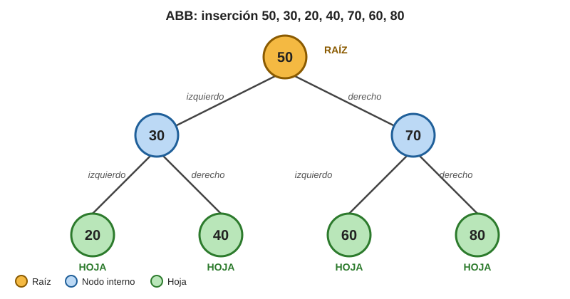
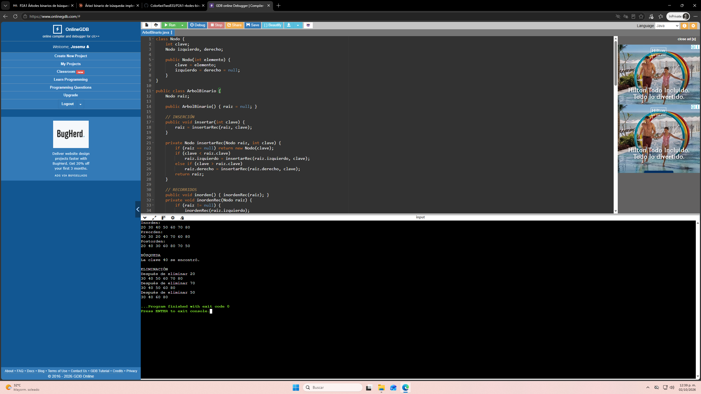

# Árbol Binario de Búsqueda (ABB) en Java
Implementación de un ABB con inserción, recorridos, **búsqueda**, **eliminación** y un método auxiliar para encontrar el **valor mínimo** de un subárbol.

## Estructura del repositorio

```
.
├── README.md                 ← dibujo, código explicado y respuestas
├── src/
│   ├── ArbolBinario.java     ← código completo (Nodo + ArbolBinario)
│   └── Pruebas.java          ← pruebas adicionales de búsqueda y eliminación
├── docs/
│   └── arbol-inicial.svg     ← dibujo del árbol inicial
├── salidas/                  ← salida de consola de cada programa (texto)
└── capturas/                 ← capturas de pantalla de las pruebas
```

## Cómo ejecutar

```bash
javac -d out src/*.java
java -cp out ArbolBinario     # programa principal de la actividad
java -cp out Pruebas          # pruebas adicionales
```

---

## Dibujo del árbol inicial

Inserción en este orden: **50, 30, 20, 40, 70, 60 y 80**.



Versión en texto:

```
              50            ← RAÍZ
            /    \
          30      70
         /  \    /  \
       20   40  60   80     ← HOJAS: 20, 40, 60, 80
```

| Nodo | Hijo izquierdo | Hijo derecho | Tipo |
|------|----------------|--------------|------|
| 50   | 30             | 70           | Raíz |
| 30   | 20             | 40           | Interno |
| 70   | 60             | 80           | Interno |
| 20   | null           | null         | Hoja |
| 40   | null           | null         | Hoja |
| 60   | null           | null         | Hoja |
| 80   | null           | null         | Hoja |

---

## Preguntas

### 1. ¿Qué propiedad debe cumplir todo ABB?

Para **cada nodo**, todas las claves de su subárbol izquierdo son **menores** que la clave del nodo, y todas las claves de su subárbol derecho son **mayores**. Esto se cumple de forma recursiva en cada subárbol (y en esta implementación no se permiten claves repetidas).

### 2. ¿Cuál es la raíz del árbol construido?

La raíz es **50**, porque fue el primer valor insertado.

### 3. ¿Qué nodos son hojas?

**20, 40, 60 y 80**, porque no tienen hijo izquierdo ni derecho.

### 4. Subárbol izquierdo y derecho de 50

- Subárbol izquierdo: **30, 20, 40** (todos menores que 50).
- Subárbol derecho: **70, 60, 80** (todos mayores que 50).

### 5. ¿Qué secuencia se obtiene con el recorrido inorden?

**20 30 40 50 60 70 80**: las claves salen en orden ascendente (izquierdo → nodo → derecho).

---

## 6. Método de búsqueda

```java
private boolean buscarRec(Nodo raiz, int clave) {
    // Caso base 1: llegamos a un null, la clave no existe
    if (raiz == null) return false;

    // Caso base 2: la clave coincide con la del nodo actual
    if (clave == raiz.clave) return true;

    // Caso recursivo: la propiedad del ABB indica por cuál subárbol seguir
    if (clave < raiz.clave)
        return buscarRec(raiz.izquierdo, clave);
    else
        return buscarRec(raiz.derecho, clave);
}
```

**¿Por qué no es necesario recorrer todos los nodos?**
Porque en cada comparación la propiedad del ABB permite **descartar un subárbol completo**: si la clave es menor que el nodo actual, no puede estar en el subárbol derecho, y viceversa. Así solo se recorre un camino desde la raíz hacia abajo, y el costo depende de la altura del árbol, no de la cantidad total de nodos.

**Si se busca 40, ¿qué nodos se visitan y en qué orden?**
**50 → 30 → 40.** 40 < 50 (izquierda), 40 > 30 (derecha) y 40 == 40 (encontrado). Se visitan 3 de los 7 nodos.

**Si se busca 90, ¿qué condición permite concluir que no existe?**
Se visita 50 → 70 → 80; como 90 > 80 se baja por el hijo derecho de 80, que es `null`. La condición **`raiz == null`** indica que se llegó al final del camino sin encontrar la clave.

**¿Qué valor booleano regresa el caso base cuando el nodo actual es null?**
**`false`**, porque no hay más nodos donde buscar.

**¿Qué ocurriría si el árbol no respetara la regla menor-izquierda y mayor-derecha?**
La búsqueda dejaría de ser confiable: podría descartar justo el subárbol donde está la clave y devolver `false` aunque exista (falso negativo). Para estar seguros habría que recorrer **todos** los nodos, perdiendo la ventaja del ABB.

---

## 7. Método de eliminación

```java
private Nodo eliminarRec(Nodo raiz, int clave) {
    // Si llegamos a null la clave no existe: no se modifica nada
    if (raiz == null) return null;

    // 1) Localizar el nodo; cada padre se reconecta con lo que devuelve la llamada
    if (clave < raiz.clave) {
        raiz.izquierdo = eliminarRec(raiz.izquierdo, clave);
    } else if (clave > raiz.clave) {
        raiz.derecho = eliminarRec(raiz.derecho, clave);
    } else {
        // 2) Nodo encontrado: identificar el caso

        // Caso A: hoja (sin hijos)
        if (raiz.izquierdo == null && raiz.derecho == null) {
            return null;
        }
        // Caso B: un solo hijo, ese hijo ocupa el lugar del nodo eliminado
        if (raiz.izquierdo == null) return raiz.derecho;
        if (raiz.derecho == null) return raiz.izquierdo;

        // Caso C: dos hijos, se sustituye por el menor del subárbol derecho
        raiz.clave = valorMinimo(raiz.derecho);
        // y se elimina ese valor de su ubicación original
        raiz.derecho = eliminarRec(raiz.derecho, raiz.clave);
    }
    return raiz;
}
```

**¿Por qué la eliminación requiere más casos que la búsqueda?**
Buscar solo **lee** el árbol; eliminar lo **modifica**. Al quitar un nodo hay que decidir qué ocupa su lugar y reconectar sus hijos para que el árbol siga siendo un ABB válido. Según tenga 0, 1 o 2 hijos, la reconexión es distinta.

**¿Qué debe ocurrir si la clave que se desea eliminar no existe?**
La recursión llega a `null` y devuelve `null` sin cambiar nada: el árbol queda **igual** que antes (probado con la clave 99).

**¿Por qué eliminar una hoja es el caso más sencillo?**
Porque no tiene hijos que reconectar. Basta devolver `null` y el padre queda con ese hijo vacío.

**Si un nodo tiene solo un hijo, ¿por qué puede devolverse directamente ese hijo?**
Porque todo el subárbol del hijo ya cumple la regla respecto al abuelo (estaba del mismo lado que el nodo eliminado). Al subirlo, el orden no se rompe.

**¿Por qué el menor valor del subárbol derecho sirve para sustituir a un nodo con dos hijos?**
Es mayor que todas las claves del subárbol izquierdo y menor que el resto de las del derecho, así que colocado en esa posición **mantiene la propiedad del ABB**. Además, como es el más a la izquierda, no tiene hijo izquierdo y su eliminación es un caso sencillo (hoja o un hijo).

**Después de copiar el valor sustituto, ¿por qué hay que eliminarlo de su ubicación original?**
Porque si no, la clave quedaría **duplicada** en el árbol (una vez en el nodo sustituido y otra en su lugar original), lo que rompe la propiedad del ABB.

**¿Qué riesgo existe si se elimina un nodo con dos hijos sin reconectar bien sus subárboles?**
Se podrían **perder subárboles completos** (quedarían inaccesibles y con ellos sus claves) o dejar enlaces que violen el orden del ABB.

**¿Por qué eliminar la raíz puede modificar la variable `raiz` del árbol?**
Si la raíz es hoja o tiene un solo hijo, el método devuelve `null` o ese hijo, y la raíz del árbol pasa a ser otro nodo. Por eso el método público hace `raiz = eliminarRec(raiz, clave)`.

**¿Qué propiedad debe seguir cumpliendo el árbol después de cualquier eliminación?**
La propiedad del ABB: menores a la izquierda y mayores a la derecha en cada nodo.

> **Nota:** después de las eliminaciones, el recorrido inorden conserva el orden ascendente de las claves restantes (ver las pruebas más abajo).

### Traza de las eliminaciones del programa principal

| Eliminación | Caso | Qué pasa | Inorden resultante |
|-------------|------|----------|--------------------|
| 20 | Hoja | El 30 queda con `izquierdo = null` | 30 40 50 60 70 80 |
| 70 | Dos hijos (60 y 80) | El mínimo del subárbol derecho es 80: se copia en el nodo y se elimina el 80 original | 30 40 50 60 80 |
| 50 | Raíz con dos hijos | El mínimo del subárbol derecho es 60: la raíz pasa a valer 60 y se elimina el 60 original | 30 40 60 80 |

---

## 8. Método auxiliar: encontrar el valor mínimo

```java
private int valorMinimo(Nodo nodo) {
    // El menor siempre está más a la izquierda: se baja hasta que no haya hijo izquierdo
    while (nodo.izquierdo != null) {
        nodo = nodo.izquierdo;
    }
    return nodo.clave;
}
```

- **¿Hacia qué dirección hay que desplazarse?** Siempre hacia la **izquierda**, porque los menores están a la izquierda.
- **¿Qué condición indica que ya se encontró el mínimo?** Que el nodo actual **no tiene hijo izquierdo** (`nodo.izquierdo == null`).
- **¿Cuál es el mínimo del subárbol cuya raíz es 70 en el árbol inicial?** **60** (70 → izquierdo 60, que no tiene hijo izquierdo).

---

## 9. Reflexiones finales

**¿Cómo ayuda el recorrido inorden a comprobar que el ABB conserva su estructura?**
En un ABB válido el inorden siempre produce las claves **en orden ascendente**. Si después de insertar o eliminar la secuencia sale desordenada o con repetidos, sé que algún enlace quedó mal. Es una forma rápida de verificar el árbol sin dibujarlo.

**Explica con tus palabras el caso de eliminación que consideraste más difícil.**
El de **dos hijos**, porque no se puede simplemente subir un hijo: habría dos subárboles y un solo lugar. La solución es buscar el sucesor (el menor del subárbol derecho), copiar su valor en el nodo y luego eliminar ese sucesor de su posición original, que ya es un caso fácil. Con la raíz 50 del ejemplo, el sucesor es 60: la raíz pasa a valer 60 y el nodo 60 original desaparece.

**¿Qué papel cumple la recursividad en los métodos de búsqueda y eliminación?**
Cada llamada se ocupa de un subárbol más pequeño que el anterior, y el caso base (`null`) detiene el proceso. En la eliminación además es la que **reconecta** los enlaces: al regresar de cada llamada, el padre guarda en su hijo izquierdo o derecho lo que devolvió la llamada.

**¿Qué aprendí sobre el cambio de referencias entre nodos al eliminar?**
Que no se "mueven" nodos, solo se **cambian referencias**. Líneas como `raiz.izquierdo = eliminarRec(raiz.izquierdo, clave)` son clave: si no se asigna lo que devuelve el método, el padre seguiría apuntando al nodo eliminado y el árbol quedaría mal.

**Si tuviera que explicar a un compañero la diferencia entre buscar y eliminar en un ABB:**
Buscar solo sigue un camino comparando y responde sí o no, sin tocar el árbol. Eliminar primero busca el nodo, pero después **modifica la estructura**: según tenga 0, 1 o 2 hijos, cambia enlaces (y a veces valores) para que el árbol siga cumpliendo la propiedad del ABB.

---

## 10. Pruebas y capturas de pantalla

### Programa principal (`ArbolBinario`)

Salida (también en `salidas/salida_main.txt`):

```
Inorden:
20 30 40 50 60 70 80 
Preorden:
50 30 20 40 70 60 80 
Postorden:
20 40 30 60 80 70 50 

BÚSQUEDA
La clave 40 se encontró.

ELIMINACIÓN
Después de eliminar 20
30 40 50 60 70 80 
Después de eliminar 70
30 40 50 60 80 
Después de eliminar 50
30 40 60 80 
```



### Pruebas adicionales (`Pruebas`)

Cubren la búsqueda con su ruta, los cuatro casos de eliminación (hoja, un hijo, dos hijos y raíz), la clave inexistente y el vaciado total del árbol. Salida (también en `salidas/salida_pruebas.txt`):

```
=== PRUEBA 1: BÚSQUEDA ===
Ruta para 40: 50 -> 30 -> 40
buscar(40) = true
Ruta para 90: 50 -> 70 -> 80 -> null
buscar(90) = false
Ruta para 50: 50
buscar(50) = true

=== PRUEBA 2: ELIMINACIÓN (un caso por árbol nuevo) ===
Eliminar 20 (hoja) -> inorden: 30 40 50 60 70 80 
Eliminar 30 (un hijo) -> inorden: 40 50 60 70 80 
Eliminar 70 (dos hijos) -> inorden: 20 30 40 50 60 80 
Eliminar 50 (raíz con dos hijos) -> inorden: 20 30 40 60 70 80 
Nueva raíz: 60
Eliminar 99 (clave inexistente, no cambia nada) -> inorden: 20 30 40 50 60 70 80 

=== PRUEBA 3: ELIMINAR TODO EN SECUENCIA ===
Eliminar 20 (secuencia) -> inorden: 30 40 50 60 70 80 
Eliminar 70 (secuencia) -> inorden: 30 40 50 60 80 
Eliminar 50 (secuencia) -> inorden: 30 40 60 80 
Eliminar 30 (secuencia) -> inorden: 40 60 80 
Eliminar 40 (secuencia) -> inorden: 60 80 
Eliminar 60 (secuencia) -> inorden: 80 
Eliminar 80 (secuencia) -> inorden: 
Árbol vacío: true
```


